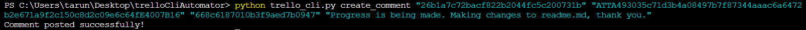

# Trello Automator using CLI

## Introduction
This **Python** application leverages the command line interface (CLI) to interact with the trello.com api. It can access your trello board using your key and token generated, which gurantees a "power up" (according to Trello) which is basically authentication for each unique user to a trello workspace. 

## Requirements: 

- *python >= 3.x*
- *You will need the "requests" library installed to process json based requests to the trello.com api*
- *The requests library has been installed in this proram using* **pip3 install requests**. *It has been imported using* **import pip._vendor.requests as requests**.
- You will need to generate a user_key and user_token to successfully interact with the Trello.com api. 
- Once generated please use those and pass them as arguments to the CLI commands. 

### Important terminology you need while using this application: 

1. **Board**: Each board has a unique board id (usually known as id) which is used to access the particualr board of choice and make changes to the boards like adding lists/coloumns. 

##### This is a board

2. **List**: A list is essentially a coloumn in a board. A list can be accessed using the idList field. You can add cards to the lists. 
#### This is a list

3. **Cards**: Cards are the most basic element of the trello board. They can be added to a list using the idList. You can add the name and the description to the card at the time of creation as well as labels. Cards can have comments and labels. 
#### This is a card

Cards can be created from the CLI using the command: 

*python trello_cli.py create_card "{user_key}" "{user_token}" "{idList}" "{Name of your card"} "{Description of your card}"*

for example:

The response if the card has been created successfully looks something like this: 

4. **Labels**: Labels can be added to the cards at the time of creation. Below are the colour codes for the various labels that can be added to the card. They can be passed at the time of creation using the optional argument *"--idLabels"*. 

        "668c3de81dc51400eb11cc57",
        "668c3de81dc51400eb11cc60",
        "668c3de81dc51400eb11cc5e",
        "668c3de81dc51400eb11cc58",
        "668c3de81dc51400eb11cc68",
        "668c3de81dc51400eb11cc69"

    Labels can be created using the command: 
    
*python trello_cli.py create_card "{user_key}" "{user_token}"  "{idList}" "{Name of your card"} "{Description of your card}" --idLabels "{id of the label you want}"*

for example: 

5. **Comments**: Comments can be added to cards after they have been created. You would need the card_id of the card you want to add the comments to. 

Comments can be added using the command:

*python trello_cli.py create_comment "{user_key}" "{user_token}" "{cardId}" "{comment}"*

for example:

## How to use: 

Run the command: *python trello_cli.py -h*  for basic help starting out. 

**Card Creation:** 

Run command: 
*python trello_cli.py create_card "{user_key}" "{user_token}" "{idList}" "{Name of your card"} "{Description of your card}"* 

Required fields: 

- user_key - the user key for your trello.com board/organistaion.
- user_token - the user token for your trello.com board/organistion.
- idList - the id list for the column you want to add the card in.
- Name of your card
- Description to be added in your card. 

**NOTE:** Enclose the required fields in "". 

**Comment Creation:** 

Run command:
*python trello_cli.py create_comment "{user_key}" "{user_token}" "{cardId}" "{comment}"* 

Required fields: 

- user_key - the user key for your trello.com board/organistaion.
- user_token - the user token for your trello.com board/organistion.
- cardId - the card id for the card you want to add the comment in.
- comment text to be added.  

**NOTE:** Enclose the required fields in "". 

## Future Developments

1) Add function to fetch all cards from a list. 

2) Add function to create new boards

3) Add function to delete cards and move cards from one list to another

4) Add function to delete comments from cards

5) Package the whole project in a Docker container for easier distribution. 

6) Set up credential authenticator for more collaborators

## Resources 

**Documentation for trello.com api**

https://developer.atlassian.com/cloud/trello/guides/power-ups/your-first-power-up/

https://developer.atlassian.com/cloud/trello/rest/api-group-actions/#api-group-actions

https://developer.atlassian.com/cloud/trello/rest/api-group-boards/#api-boards-id-get

https://developer.atlassian.com/cloud/trello/rest/api-group-cards/#api-cards-post

https://developer.atlassian.com/cloud/trello/rest/api-group-cards/#api-cards-id-actions-comments-post

